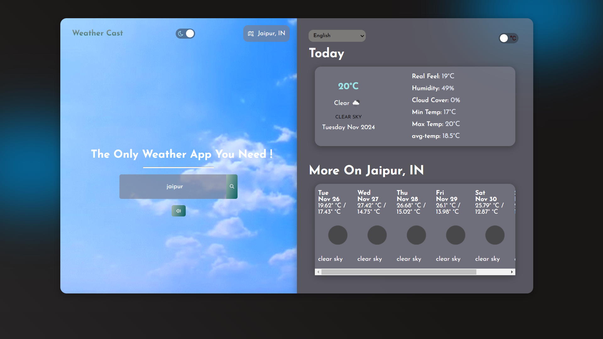

# WeatherCast

## The Ultimate Weather Forecasting App



## About

**WeatherCast** is a weather application built using ReactJS and the OpenWeatherMap API. It provides real-time weather data and forecasts, enabling users to access weather details based on their current location or any city they search for.

## Features

- **Search by city:** Get weather details for any city.
- Detailed weather information including:
  - Current temperature
  - Humidity levels
  - Cloud cover
  - Forecast for upcoming days
- **Dynamic animations:** Smooth and responsive design with animations that change based on weather conditions.

## Tech Stack

- **Frontend:** ReactJS
- **API:** OpenWeatherMap
- **Styling:** CSS
- **Deployment:** Node.js 

## Setup Guide

1. **Clone the repository** to your local machine:
   ```bash
   git clone https://github.com/iaryasharma/WeatherCast.git
   ```


2. Navigate to the project directory:
    ```bash
    cd WeatherCast
    ```
3. Create a `.env` file file in the root directory and add your OpenWeatherMap API key:

    ```bash
    REACT_APP_API_KEY=your_openweathermap_api_key
    ```
4. Get an OpenWeatherMap API key:
- Visit [OpenWeatherMap](https://openweathermap.org/)
- Sign up or log in to generate an API key.

5. Install dependencies:
    ```bash
    npm install
    ```
6. Start the development server:
    ```bash
    npm start
    ```


